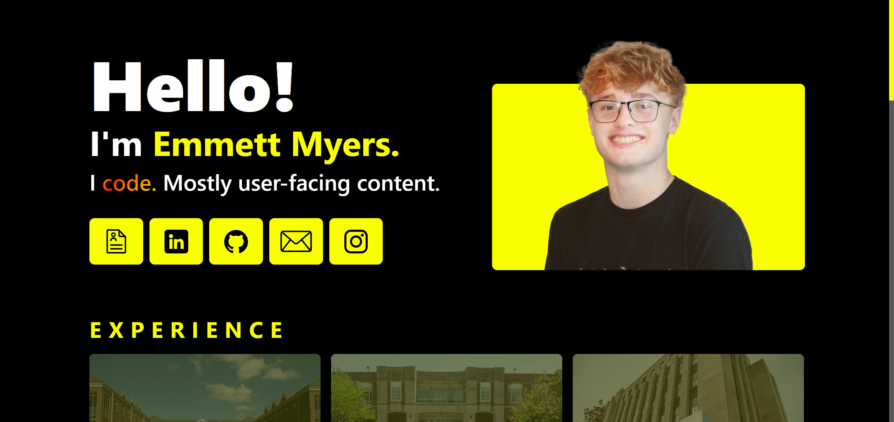
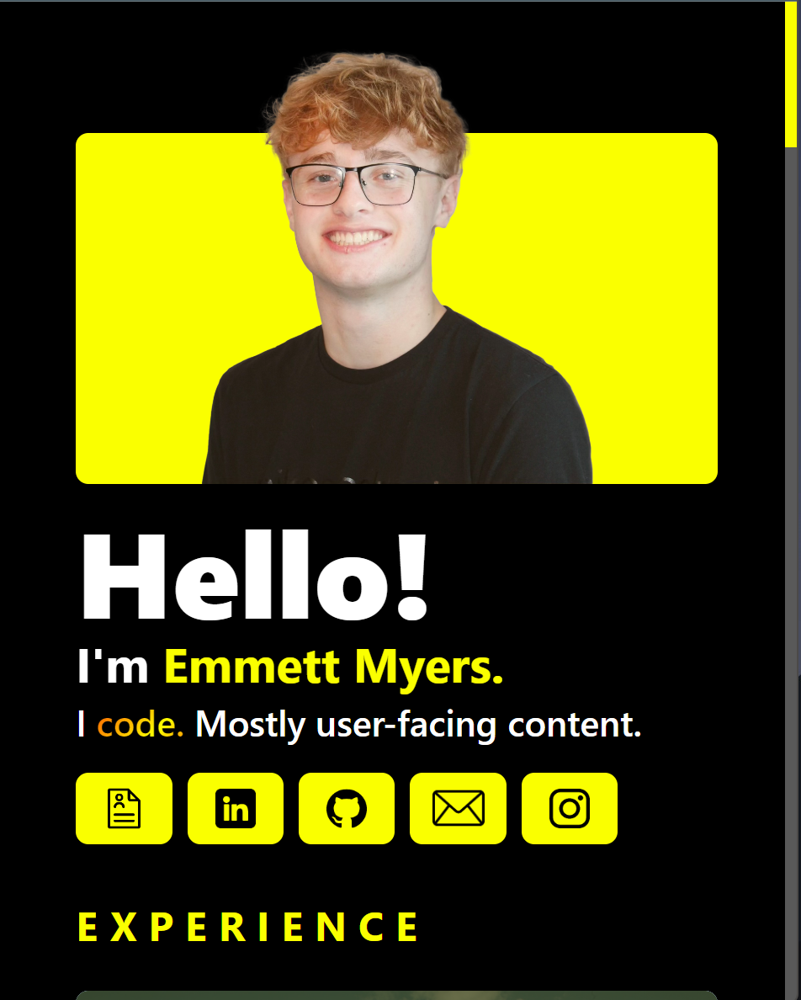
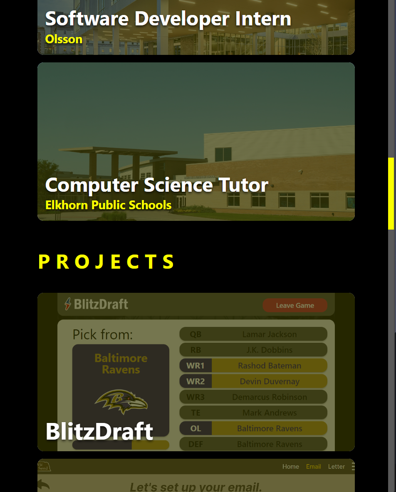
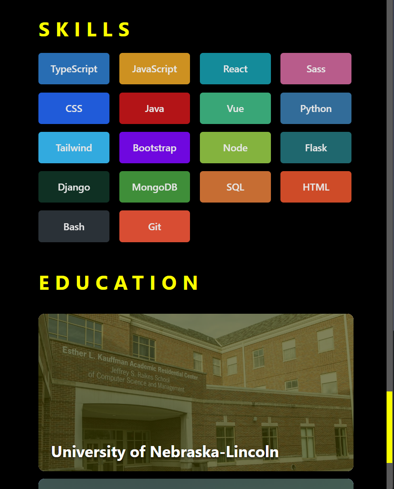

# Portfolio

[Live Demo](https://emmettmyers.me)&nbsp;&nbsp;|&nbsp;&nbsp;<i>Created: Summer 2023 (Incoming College Sophomore)</i>
 

  
  
  

 
<b>Responsive portfolio web app to show app of my projects! Also includes experience, skills, education, and contact.</b>
 
 
<b>Tools used:</b>
<ul>
  <li>TypeScript</li>
  <li>Vue</li>
  <li>HTML/SCSS</li>
  <li>Tailwind</li>
  <li>Firebase</li>
</ul>
