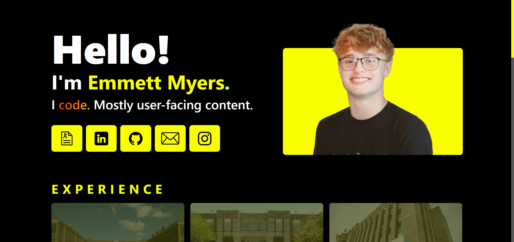
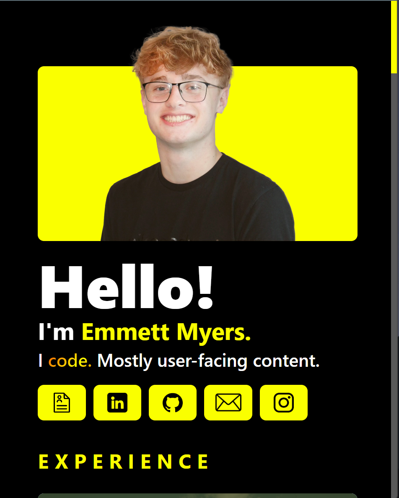
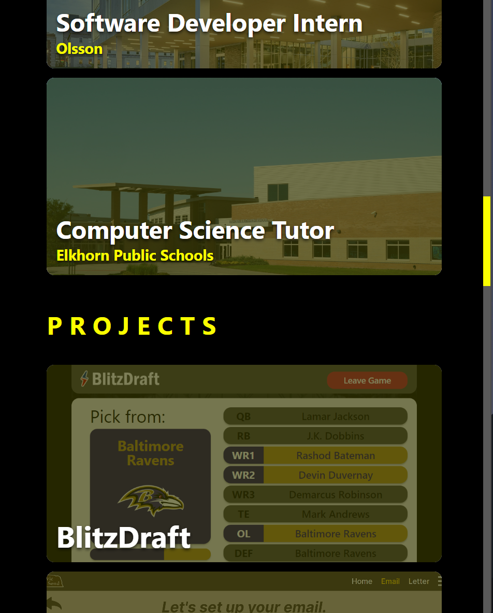
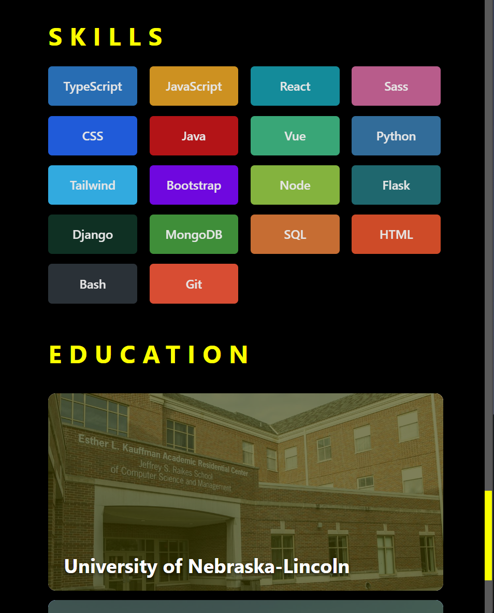

# Portfolio

[Live Demo](https://emmettmyers.me)&nbsp;&nbsp;|&nbsp;&nbsp;<i>Created: Summer 2023 (Incoming College Sophomore)</i>

 

  
  
  

 

<b>Portfolio web app to display all of my projects, experience, skills, education, and contact.</b>

Includes dynamic information rendering, responsive user interfacing, and Google Analytics.

<b>Tools used:</b>
<ul>
  <li>TypeScript</li>
  <li>Vue</li>
  <li>HTML/SCSS</li>
  <li>Tailwind</li>
  <li>Firebase</li>
</ul>
